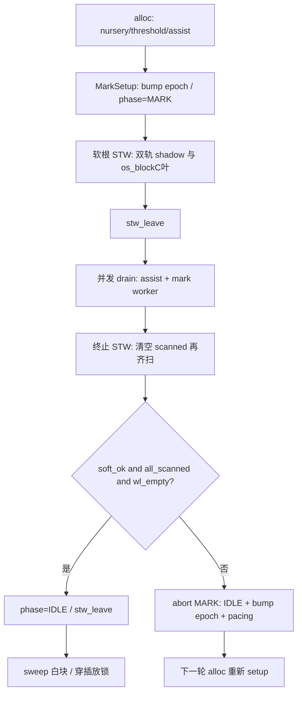

# IR ↔ GC 契约（v0.55.4+ 权威说明）

> **读者**：改 IRGen / runtime_gc / 写屏障 / STW 的人。  
> **地位**：GC 埋点、流程、规则的**唯一详文**；记忆文档 §5.4 只保留摘要并链到本文。  
> **原则**：GC 只认**可达性**——从根沿指针摸得到 = 存活；摸不到 = 可回收。

---

## 1. 一句话架构

```
IR 埋点（safepoint / 混合屏障 / shadow 精确根 / 分配 kind）
        ↓
运行时：混合屏障 + 协作软 STW + 诚实双轨根（shadow ∪ os_block C 叶）
        + mutator assist + GC 私有 mark worker
        ↓
终止齐扫 → sweep 白色；失败则 abort MARK（bump epoch，禁无限黑囤）
```

HaoLang **不做** Win `SuspendThread`；**不用** LLVM `gc.statepoint`/stackmap（文本 `.ll`→clang 管线）；精确根走 **Hao shadow stack**。  
「本批不做 concurrent sweep」是排期，不是能力天花板；与双轨根扫描无关。

---

## 2. 对象生死规则（必须遵守）

| 规则 | 含义 |
|------|------|
| R1 可达性 | 只从**根集合**沿指针找存活 |
| R2 根集合（诚实双轨） | **始终**扫 Hao shadow；`gc_roots` / `gc_root_slots`；channel/闭包显式根。另：`os_block`/`arm` 或无 shadow → **GPR + 有界 C 叶（≤4KiB）**；仅 Hao safepoint park（有 shadow、非 os_block）→ shadow-only。收集者扫 `[sp, collect_inner_frame)`（**低于** naked trampoline 溅射区），**不**扫 trampoline GPR 缓冲。**remset 不是根**：仅 **minor** 对 remset 容器 `scan_precise`（摸 old→young）；**major 禁止** seed/enqueue remset；成功 major 后整表丢弃 |
| R3 三色 | `marked == gc_mark_epoch` = 本轮已标；worklist = 灰；其余 = 白 |
| R4 黑分配 | `GC_PHASE_MARK` 时新对象直接打上当前 epoch（黑），**不入队**；批量填入指针必须另有 shade |
| R5 混合屏障 | 堆/静态 GC 槽写：**dst=槽地址**；先 `hao_gc_barrier(dst,new)` 再 store。MARK 期 **shade(old)+shade(new)**；IDLE 仅 remset。shade 前禁止 safepoint；STW 重试后须重 load old |
| R6 终止 | 每一轮 terminate **清空 scanned**；本轮 soft STW **齐 park** 且 worklist 空才可 sweep |
| R7 abort | 终止失败 → IDLE + 丢 worklist + bump epoch + pacing |
| R8 批量拷贝 | 须 **同锁原子**（`hao_gc_array_copy_and_shade`） |
| R9 精确根 | GC 指针局部/参数 alloca：`hao_gc_root_push`；函数出口 `hao_gc_root_unwind(wm)`。**跨 safepoint/调用仍存活的 GC 指针必须在 shadow（或显式根）**——含 when.subj/res、catch 绑定、select、finally 的 unwind GC 槽、`$new`/语言 `new`/aspread·asize、for.seq/iter。**循环内**合成根走 spill 池（循环前预分配+acquire，禁止每轮 `root_push`）；层/轮结束按 `scopeStack` `store null`。`new` 构造窗内勿清 objSlot（防 SSA 假死） |

---

## 3. 一轮收集流程



| 阶段 | STW？ | 持锁要点 |
|------|-------|----------|
| Mark setup | 软根 STW（可未齐） | 先开屏障再扫根 |
| 并发 mark | 否 | drain 每 16 步可放锁；**2 条 GC 私有 worker** 同锁取灰 |
| 终止 | 软 STW，**必须齐** | 重扫根+双轨；worklist 清空 |
| Sweep | 否（已 leave） | 每 128 块放锁 |
| Abort | leave | 不 sweep；色作废 |

---

## 4. IR 埋点一览（编译器责任）

### 4.1 Safepoint

| 埋点 | 位置 |
|------|------|
| 循环条件 | `IRGenControl`：while / for / foreach / select |
| 函数/lambda 入口 | `genFunctionBody` / `IRGenLambda` |
| staticinit / `$new*` / aspread·asize | `IRGenClass` / `IRGenLiteral` |
| 运行时 | alloc / barrier 抢锁前 / `os_block_*` / Mutex 自旋 |

### 4.2 混合屏障

| API | 顺序 |
|-----|------|
| `hao_gc_barrier(slot, new)` | **先 barrier，再 store**；`slot` 必须是可解引用槽地址 |
| 静态 | `emitGlobalGcStore` → 同上（gptr 即槽） |

覆盖：实例字段、`a[i]=`、boxed cell、闭包捕获、by-ref 数组写回、`new` 字段默认、枚举/Class 静态等。

**故意不走屏障**：栈临时（精确根 + 终止重扫）；虚表 / fnptr。

### 4.3 Hao 精确根（shadow stack）

| API | 语义 |
|-----|------|
| `hao_gc_root_watermark()` | 函数入口保存水位 |
| `hao_gc_root_push(slot)` | 登记 GC 指针 alloca 地址 |
| `hao_gc_root_unwind(wm)` | 函数出口（含 return / unwind ret）回退 |

**while / for-in 体内 var/val**：alloca +（若 GC）`root_push` **提到循环前**，每轮只 `store`；循环结束 GC 槽 `store null`。禁止每轮 `root_push`（08-gc-monitor / v0.55.3–0.55.4）。

**循环 spill 池（v0.55.5）**：嵌套 while/for **共用一层池**；在循环**之前**预分配 ptr 槽并 `root_push`（支配全部 use，禁止 body 内临时 `alloca`）；`emitSpillGcRoot` / when / catch / for.seq·iter / 未提升 GC 局部 `acquire` 复用；每层 `scopeStack`；for 用 sticky+`recycle`；**内层 clear 不得清外层槽**。try 正常结束：catch 绑定 + `unwindGcRoot` 置 null。

**方法 / lambda 结束**：入口 `hao_gc_root_watermark`，return / 隐式 return 时 `hao_gc_root_unwind`（整帧 shadow 回退）。

**普通 `{ }` 块**：符号表有作用域；shadow **不**在块尾提前 unwind（对齐「帧内死局部可拖到 return」）。无限循环里的短生命周期对象靠 **提升 + spill 池**，不是靠「文档写了限制就算了」。

### 4.4 分配

| IR / API | kind |
|----------|------|
| `hao_object_new` | SLOTS（>32→FULL） |
| `hao_array_new` | ARRAY + is_ptr |
| `hao_str_*` / box | OPAQUE |

---

## 5. C / runtime 埋点一览

| 路径 | 契约 |
|------|------|
| `hao_array_push` | 扩容：`copy_and_shade`；单元素：`barrier(slot,…)` |
| reflect String set / `hao_make_args` | `barrier` 槽地址 |
| sleep / net / fs / os / join / pool join | `os_block_*`（置 `g_in_os_block`，STW 加扫 C 叶） |
| net/fs/os 持 GC 指针跨 block | os_block 跨度 **`hao_gc_add_root` + `hao_gc_remove_root` 成对**（禁只加不摘） |
| channel send/try_send | **先 root 再 chan_lock** |
| `hao_sync_lock` | 自旋失败路径 safepoint |
| finalizer | 回调后仍可达 → 挂回堆，否则 free |
| mark worker | **持锁外**启动；勿用 `hao_pool`；**不** `gc_register_thread` |

---

## 6. 统计与观测

一次持锁：`hao_gc_stats` → `GC.stats()`。

| 字段 | 含义 |
|------|------|
| `heapBytes` | 当前堆压（优先看这个） |
| `liveBytes` | 上次成功 major 后存活 |
| `concurrentMarkCycles` / `markAssistSteps` | 并发 mark / assist |
| `markWorkerSteps` | **GC 私有 worker** 推进灰块数（v0.54） |
| `stwIncomplete` / `markAbortCycles` | 握手失败 |
| `remsetCount` | 分代 remset 条目数（**仅服务 minor**；major 不 seed） |

---

## 7. 与 Go 的对齐 / 有意差异

| 点 | Hao（v0.55.5） | Go 方向 |
|----|--------------|---------|
| 可达性 + 三色 + 混合屏障 | ✅ | ✅ |
| 短 STW 根/终止 | 软 STW + 超时 abort | 更短 |
| Hao 帧精确根 | ✅ shadow + **循环 spill 池**（when/catch/select/new/for.seq…） | 栈图 |
| C runtime 帧 | os_block 时有界保守 + 显式根 | 较少混 C |
| mark worker | ✅ 私有线程 | ✅ |
| 抢占 | 协作 + os_block | 信号更强 |
| concurrent sweep / span | **排期（停顿优化，非假活借口）** | 有 |
| LLVM stackmap | **架构不用**（shadow 替代） | N/A |
| Win SuspendThread | **禁止（架构）** | N/A |

---

## 8. 改代码检查清单

1. 堆指针写是否 **槽地址** + 先 barrier 再 store？  
2. 批量拷贝是否同锁 shade？  
3. 阻塞是否 `os_block`？C 持 GC 指针是否 **`add_root` 且离开后 `remove_root`**？  
4. GC 局部是否 `root_push`，出口是否 `unwind`？when/catch/select/unwind/`$new`/aspread 呢？  
5. 持非 GC 锁时是否禁止调 `hao_gc_*`？  
6. mark worker 是否在**持锁外**启动？  
7. STW 是否仍对 os_block 扫 C 叶（勿再「有 shadow 就 return」）？  
8. `GcStats` 字段序是否与 `hao_gc_stats` 锁定？  
9. 循环内合成根是否走 **spill 池**（预分配+acquire）；内层 clear 是否只动本层 `scopeStack`？  
10. major 路径是否**禁止**把 remset 当根 enqueue？晋升后是否**勿**盲目 `remset_add`（只靠屏障记真实 old→young）？  
11. while/**for-in** 体内 GC `var` 是否**提升**；`new` 是否保留 objSlot 至调用方根/池清？  
12. try 正常结束是否清 catch 绑定 + `unwindGcRoot`？

验收：

```text
hao run test/gc_reclaim_smoke.hao
hao run test/gc_concurrent_mark_smoke.hao
hao run test/gc_stw_warmup_smoke.hao
hao run test/gc_array_barrier_smoke.hao
hao run test/gc_finalizer_resurrect_smoke.hao
hao run test/gc_hybrid_barrier_smoke.hao
hao run test/gc_precise_roots_smoke.hao
hao run test/gc_root_when_catch_smoke.hao
hao run test/gc_root_select_smoke.hao
hao run test/gc_os_root_belt_smoke.hao
hao run test/gc_html_refresh_smoke.hao
hao run test/gc_remset_major_smoke.hao
hao run test/gc_loop_var_root_smoke.hao
hao run test/gc_for_var_root_smoke.hao
hao run test/gc_loop_spill_pool_smoke.hao
```

---

## 9. 相关文件

| 区域 | 文件 |
|------|------|
| IR | `IRGenValue.cpp`、`IRGen.cpp`、`IRGenLambda.cpp`、`IRGenControl.cpp`、`IRGenExcept.cpp`、`IRGenClass.cpp`、`IRGenLiteral.cpp`、`IRGenExpr.cpp` |
| GC | `stdlib/runtime_gc.c`、`runtime_internal.h` |
| 数组/反射/fs/os | `runtime_array.c`、`runtime_reflect.c`、`runtime_string.c`、`runtime_fs.c`、`runtime_os.c` |
| API / 面板 | `stdlib/src/gc/GC.hao`、`haolang-example/08-gc-monitor/` |
| 历史坑 | `docs/坑债.md`（BI～BZ） |
