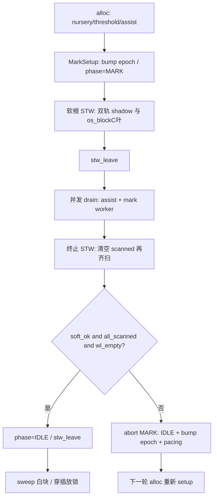

# IR ↔ GC 契约（v0.55.10+ 权威说明）

> **读者**：改 IRGen / runtime_gc / 写屏障 / STW 的人。  
> **地位**：GC 埋点、流程、规则的**唯一详文**；记忆文档 §5.4 只保留摘要并链到本文。  
> **原则**：GC 只认**可达性**——从根沿指针摸得到 = 存活；摸不到 = 可回收。  
> **诚实边界**：主路径按可达性工程化；continue 穿过 finally 时**禁止**先 `clearLoopSpillSlots`（坑债 CE）。concurrent sweep 是停顿排期，**不是**假死借口。

---

## 1. 一句话架构

```
IR 埋点（safepoint / 混合屏障 / shadow 精确根 / 分配 kind）
        ↓
运行时：混合屏障 + 协作软 STW + 诚实双轨根（shadow ∪ os_block C 叶）
        + mutator assist + GC 私有 mark worker
        ↓
终止齐扫 → sweep 白色；失败则 abort MARK（bump epoch，禁无限黑囤）
```

HaoLang **不做** Win `SuspendThread`；**不用** LLVM `gc.statepoint`/stackmap（文本 `.ll`→clang 管线）；精确根走 **Hao shadow stack**。  
「本批不做 concurrent sweep」是排期，不是能力天花板；与双轨根扫描无关。

---

## 2. 对象生死规则（必须遵守）

| 规则 | 含义 |
|------|------|
| R1 可达性 | 只从**根集合**沿指针找存活 |
| R2 根集合（诚实双轨） | **始终**扫 Hao shadow、pins、**refl_i64_pins**（旧 `array_get_ptr`/`objOf` 皮带；v0.55.21+）、GPR spill、有界 C 叶（≤4KiB）。**反射调用对标 Java**：引用返回须 `invokeObj`（托管 `Object?`）；`invoke():Long` **禁止**藏堆指针（v0.55.22）。收集者扫 `[sp, collect_inner_frame)`（**低于** naked trampoline 溅射区），**不**扫 trampoline GPR 缓冲。**remset 不是根**：仅 **minor** 对 remset 容器 `scan_precise`（摸 old→young）；**major 禁止** seed/enqueue remset；成功 major 后整表丢弃。**minor 栈根命中 old**：须 `scan_precise` 入灰 young 子（不回收 old）。**晋升**：minor 后仅对仍握 young 子的晋升对象 `remset_add`（v0.55.20；禁盲目挂 OPAQUE） |
| R3 三色 | `marked == gc_mark_epoch` = 本轮已标；worklist = 灰；其余 = 白 |
| R4 黑分配 | `GC_PHASE_MARK` 时新对象直接打上当前 epoch（黑），**不入队**；批量填入指针必须另有 shade |
| R5 混合屏障 | 堆/静态 GC 槽写：**dst=槽地址**；先 `hao_gc_barrier(dst,new)` 再 store。MARK 期 **shade(old)+shade(new)**；IDLE 仅 remset。shade 前禁止 safepoint；STW 重试后须重 load old |
| R6 终止 | 每一轮 terminate **清空 scanned**；本轮 soft STW **齐 park** 且 worklist 空才可 sweep |
| R7 abort | 终止失败 → IDLE + 丢 worklist + bump epoch + pacing |
| R8 批量拷贝 | 须 **同锁原子**（`hao_gc_array_copy_and_shade`） |
| R9 精确根 | GC 指针局部/参数 alloca：`hao_gc_root_push`；函数出口 `hao_gc_root_unwind(wm)`。**跨 safepoint/调用仍存活的 GC 指针必须在 shadow**——含 when/catch/select/unwind/`$new`/new/aspread·asize/空数组、for.seq/iter、**自由函数/pkg.fn/super/泛型/Func 实参与 env**、**方法 recv/实参**、字段赋值 recv、数组字面量元素、字符串 `+`（**先 root 左再求右**）/`??`/`?.`（base+phi）/下标/`==`、模板 acc、haoroutine/lambda/**函数值** env、**`formatCallArg` 因 `hao_box_*` 新产生的指针**（均 `rootGcOperand`）。**循环内**走 spill 池；非循环 spill 的 alloca **进 entry**。`new`/aspread 返回前勿清结果槽；`when.res` 须先 spill 结果再清槽。**禁**：对已挂根实参在 `formatCallArg` 无差别再 spill；**禁** `boxToNullable` 内 root（phi 前驱） |

---

## 3. 一轮收集流程



| 阶段 | STW？ | 持锁要点 |
|------|-------|----------|
| Mark setup | 软根 STW（可未齐） | 先开屏障再扫根 |
| 并发 mark | 否 | drain 每 16 步可放锁；**2 条 GC 私有 worker** 同锁取灰 |
| 终止 | 软 STW，**必须齐** | 重扫根+双轨；worklist 清空 |
| Sweep | 否（已 leave） | 每 128 块放锁 |
| Abort | leave | 不 sweep；色作废 |

---

## 4. IR 埋点一览（编译器责任）

### 4.1 Safepoint

| 埋点 | 位置 |
|------|------|
| 循环条件 | `IRGenControl`：while / for / foreach / select |
| 函数/lambda 入口 | `genFunctionBody` / `IRGenLambda` |
| staticinit / `$new*` / aspread·asize | `IRGenClass` / `IRGenLiteral` |
| 运行时 | alloc / barrier 抢锁前 / `os_block_*` / Mutex 自旋 |

### 4.2 混合屏障

| API | 顺序 |
|-----|------|
| `hao_gc_barrier(slot, new)` | **先 barrier，再 store**；`slot` 必须是可解引用槽地址 |
| 静态 | `emitGlobalGcStore` → 同上（gptr 即槽） |

覆盖：实例字段、`a[i]=`、boxed cell、闭包捕获、by-ref 数组写回、`new` 字段默认、枚举/Class 静态等。

**故意不走屏障**：栈临时（精确根 + 终止重扫）；虚表 / fnptr。

### 4.3 Hao 精确根（shadow stack）

| API | 语义 |
|-----|------|
| `hao_gc_root_watermark()` | 函数入口保存水位 |
| `hao_gc_root_push(slot)` | 登记 GC 指针 alloca 地址 |
| `hao_gc_root_unwind(wm)` | 函数出口（含 return / unwind ret）回退 |

**while / for-in 体内 var/val**：alloca +（若 GC）`root_push` **提到循环前**，每轮只 `store`；循环结束 GC 槽 `store null`。禁止每轮 `root_push`（08-gc-monitor / v0.55.3–0.55.4）。

**循环 spill 池（v0.55.5）**：嵌套 while/for **共用一层池**；在循环**之前**预分配 ptr 槽并 `root_push`（支配全部 use，禁止 body 内临时 `alloca`）；`emitSpillGcRoot` / when / catch / for.seq·iter / 未提升 GC 局部 `acquire` 复用；每层 `scopeStack`；for 用 sticky+`recycle`；**内层 clear 不得清外层槽**。try 正常结束：catch 绑定 + `unwindGcRoot` 置 null。

**方法 / lambda 结束**：入口 `hao_gc_root_watermark`，return / 隐式 return 时 `hao_gc_root_unwind`（整帧 shadow 回退）。

**普通 `{ }` / if / when / try / select case / 函数·lambda 体（v0.55.7～0.55.8）**：结束时对作用域内 GC 槽 **`store null`**（**禁止**块级 `root_unwind`，曾致套件 AV）。参数槽仍活到 `root_unwind`。无限循环短生命周期靠 **提升 + spill 池 + 块尾清槽**。**continue/break（v0.55.10 CE）**：有 try 时只 `emitUnwind`，**禁止**先 `clearLoopSpillSlots`（会杀 catch 池槽）；while 在 `condL` 入口补清；池槽禁止 `noteBlockGcSlot`。

### 4.3.1 嵌套清槽纪律（设计硬约束）

语法上 while/for/try/if/when/select/`{ }` **任意嵌套、层数不限**。清槽必须按「谁拥有槽、何时槽已死」分层，禁止「非拥有者提前抹掉仍存活的根」。

| 层 | 拥有者 | 何时可 `store null` / clear | 禁止 |
|----|--------|------------------------------|------|
| 函数 shadow | `root_push` 水位 | 仅 `root_unwind(wm)`（return / 帧退出） | 块级 `root_unwind` |
| 块/分支局部 | `noteBlockGcSlot`（**非池** alloca） | `endBlockGcScope`（该 `{ }`/if/when/case 结束） | 把 **spill 池槽** 记入 noteBlock |
| 循环 spill 池 | `scopeStack` / sticky | **本层** fallthrough/`condL`/`step`/`leave`；内层 clear 不得动外层 base 以下；**sticky（条件根/for.seq）clear 不得抹/pop**（v0.55.19） | 在 `emitUnwind`（穿 finally）**之前** clear/recycle |
| while 条件 | 先卸**本层** floor 以上条件 sticky（`stickyFloor`，v0.55.34）→ `genExpr` 挂根 → `pin` → `safepoint` | 禁止 `sticky.size()>1` 剥外层（嵌套 while 会把外层裸块 junk 池槽 `store null` 写进内层 cond）；禁止先 safepoint 再求条件；禁止每轮只 pin 不卸 |
| catch 绑定 | try 设置时 acquire（循环内=池槽） | try **正常** end 清绑定；continue 穿 finally 后由 while `condL` / for `step` 清 | continue/break 入口抢先 clear |
| select spill | `selSpillSlots` | select **end** 清 | 与池 sticky 混淆时 noteBlock |

**非局部出口（return / break / continue / throw）**：

1. 先写 unwind reason，**按 try 嵌套由内向外**跑 finally（`emitUnwind`）。  
2. **finally 跑完之前**，不得 clear 仍可能被本层 catch/池槽引用的根。  
3. 到达真正目标后再清：while → `condL`/`leave`；for → `step` recycle / `leave`；return → `root_unwind`。

**池槽 vs 块槽**：`emitSpillGcRoot` / `acquireLoopGcSlot` 的寿命由池管；`noteBlockGcSlot` 只登记「块拥有的独立 alloca」。混用 = 块尾误杀池 → 假死（CE 同类）。

**非局部出口补记（v0.55.37）**：cleanup 在跳到 break/continue 目标前必须清 `unwindReason`（否则下一轮 try 正常落入 cleanup 仍按 reason=3 跳回 → 死循环）。`HAO_GC_VERIFY` 在 `gc_collect` / `gc_run_collect_locked`（trampoline **外**）collect 前/后扫 shadow；勿在裸垫片内调 CRT fatal。

**控制面 / 清槽自检 / VERIFY 重入（v0.55.39）**：return / finally 内 throw / select×try / when×try 见 `gc_try_control_root_smoke`；finally 内 throw 后勿清 `blockTerminated_`（否则外层误 `br cleanup`）。清槽 `target < base` 打 `hao:irgen:clear_spill_underflow`；`HAO_IRGEN_STRICT=1` 记诊断。collect 重入跳过 VERIFY 时累加 `hao_gc_verify_skip_reenter`（metrics `verifySkipReenter`）。

**盲区冒烟 / VERIFY 槽定位 / 清槽 TRACE（v0.55.40）**：`break` 穿 finally、`lambda`×try×finally 见 U6 两文件。VERIFY 坏根 fatal 含 `shadow_i=`/`ptr=`。`HAO_IRGEN_TRACE=1` 时 `clearLoopSpillSlots` 正路径打 `hao:irgen:clear_spill base=…`。

**线程/再抛 / pin VERIFY / 薄 dbg.value（v0.55.41）**：`gc_try_thread_finally_root_smoke`、`gc_try_rethrow_multilayer_root_smoke`。VERIFY 亦扫 scan pin（`pin_i=`）；`hao_debug_poison_scan_pin`。`-g` 局部初值薄 `llvm.dbg.value`。

**Unit-lambda ret / remset VERIFY / 赋值 dbg.value（v0.55.42）**：`emitLambdaImpl` 保存并清 `inMain_`（禁 Unit-lambda×try 误 `ret i32`）；`gc_try_unit_lambda_finally_root_smoke`。VERIFY 扫 remset（`remset_i=`）；`hao_debug_poison_remset`。简单局部赋值薄 `dbg.value`。

**refl_i64 VERIFY / 复合·字段 dbg.value / acquire TRACE（v0.55.43）**：VERIFY 扫 `g_refl_i64_pins`（`refl_i64_i=`）；`hao_debug_poison_refl_i64`。复合赋值与字段 `=` 薄 `dbg.value`。`HAO_IRGEN_TRACE` 增 `hao:irgen:acquire_spill`。

**下标 dbg.value / GPR VERIFY / recycle TRACE / 方法 try（v0.55.44）**：下标 `=`/复合写回薄 `dbg.value`。VERIFY 扫 `g_gpr_spill`（堆区外非堆值跳过；`gpr_i=`）；`hao_debug_poison_gpr`。`HAO_IRGEN_TRACE` 增 `hao:irgen:recycle_spill`。`gc_try_method_finally_root_smoke`。**非** C 叶/全线程 VERIFY；**全量** Unwind 仍开。

**字段复合 dbg.value / unpin·leave TRACE / C 叶毒针 / catch-only（v0.55.45）**：字段/静态复合写回薄 `dbg.value`。`HAO_IRGEN_TRACE` 增 `unpin_spill`/`leave_spill`。VERIFY C 叶**仅毒针**（`leaf_i=`；禁真实叶全扫）；`hao_debug_poison_c_leaf`。`gc_try_catch_only_root_smoke`。**非**跨线程/真实叶 VERIFY；**全量** Unwind 仍开。

**pin·enter TRACE / for 迭代 dbg.value / ctor·静态 try（v0.55.46）**：`HAO_IRGEN_TRACE` 增 `pin_spill`/`enter_spill`。for 循环变量每轮迭代薄 `dbg.value`。`gc_try_ctor_finally_root_smoke`、`gc_try_static_method_finally_root_smoke`。**全量** Unwind 仍开。

**sticky·block TRACE / catch dbg.value / haoroutine·when×for try（v0.55.47）**：`HAO_IRGEN_TRACE` 增 `sticky_floor`/`block_enter`/`block_leave`。catch 绑定薄 `dbg.value`。`gc_try_haoroutine_finally_root_smoke`、`gc_try_when_for_finally_root_smoke`。**全量** Unwind 仍开。

**grow_spill TRACE / lambda·select 薄 DI / nested-catch（v0.55.48）**：`HAO_IRGEN_TRACE` 增 `hao:irgen:grow_spill`。lambda 形参与 select 接收绑定薄 `dbg.declare`/`dbg.value`。`gc_try_nested_catch_root_smoke`（`catchDepth_`）。**非** TRACE 全收口；**全量** Unwind / 完整类型仍开。

**unwind TRACE / fn·this dbg.value / catch-finally-throw / ext 毒针（v0.55.49）**：`HAO_IRGEN_TRACE` 增 `unwind`/`catch_enter`/`catch_leave`/`gc_unwind`。形参与 `this` 初值薄 `dbg.value`。`gc_try_catch_finally_throw_root_smoke`。VERIFY `hao_debug_poison_ext_root`（`ext_i=`；仅毒针）。**非** TRACE 全收口；**非**跨线程 VERIFY；**全量** Unwind / 完整类型仍开。

**note_block·unwind_gc TRACE / lambda 捕获 DI / select-in-catch（v0.55.50）**：`HAO_IRGEN_TRACE` 增 `note_block`/`unwind_gc`。lambda 捕获 unpack 薄 DI。`gc_try_select_in_catch_root_smoke`。**非** TRACE 全收口；**全量** Unwind / 完整类型仍开；跨线程 VERIFY 仍开。

**leave noop·非池 acquire TRACE / new 字段默认 DI / for-in-catch（v0.55.51）**：`HAO_IRGEN_TRACE` 增 `leave_spill noop=1`、`acquire_spill pool=0`。`new`/reflect `$new` 字段默认薄 `dbg.value`。`gc_try_for_in_catch_root_smoke`。**非** TRACE 全收口（统一 helper 仍开）；**全量** Unwind / 完整类型仍开；跨线程 VERIFY 仍开。

**后续增强方向**（未做）：按「支配/最后 use」缩小非循环 spill 假活；工业级全量 Unwind↔GC；语句级 expr 清槽；完整 Hao 类型/`dbg.value` 全覆盖；TRACE 全收口（统一 helper 等）；真实 C 叶槽 / 跨线程 VERIFY。

### 4.4 分配

| IR / API | kind |
|----------|------|
| `hao_object_new` | SLOTS（>32→FULL） |
| `hao_array_new` | ARRAY + is_ptr |
| `hao_str_*` / box | OPAQUE |

---

## 5. C / runtime 埋点一览

| 路径 | 契约 |
|------|------|
| `hao_array_push` | 扩容：`copy_and_shade`；单元素：`barrier(slot,…)` |
| reflect String set / `hao_make_args` | `barrier` 槽地址 |
| sleep / net / fs / os / join / pool join | `os_block_*`（置 `g_in_os_block`，STW 加扫 C 叶） |
| net/fs/os 持 GC 指针跨 block | os_block 跨度 **`hao_gc_add_root` + `hao_gc_remove_root` 成对**（禁只加不摘） |
| `hao_array_push` / `str_concat` / `substring` / `reflect_invoke` | 分配前**直接** `add_root`（**禁止**先 `is_heap_ptr`——其内 safepoint 会假死）；扩容换指针须 remove 旧 + add 新 |
| channel send/try_send | **先 `hao_gc_add_root_if_heap` 再 chan_lock**（整型载荷勿进根表） |
| `hao_str_trim` / `to_upper` / `to_lower` / `byte_slice` / `hao_make_args` | 分配前直接 `add_root`（禁 `is_heap_ptr` 前置） |
| `hao_regex_compile` | pattern 成对挂根 |
| `hao_sync_lock` | 自旋失败路径 safepoint |
| finalizer | 回调后仍可达 → 挂回堆，否则 free |
| mark worker | **持锁外**启动；勿用 `hao_pool`；**不** `gc_register_thread` |

---

## 6. 统计与观测

一次持锁：`hao_gc_stats` → `GC.stats()`。

| 字段 | 含义 |
|------|------|
| `heapBytes` | 当前堆压（优先看这个） |
| `liveBytes` | 上次成功 major 后存活 |
| `concurrentMarkCycles` / `markAssistSteps` | 并发 mark / assist |
| `markWorkerSteps` | **GC 私有 worker** 推进灰块数（v0.54） |
| `stwIncomplete` / `markAbortCycles` | 握手失败 |
| `remsetCount` | 分代 remset 条目数（**仅服务 minor**；major 不 seed） |

---

## 7. 与 Go 的对齐 / 有意差异

| 点 | Hao（v0.55.10） | Go 方向 |
|----|--------------|---------|
| 可达性 + 三色 + 混合屏障 | ✅ 主路径 | ✅ |
| 短 STW 根/终止 | 软 STW + 超时 abort | 更短 |
| Hao 帧精确根 | ✅ shadow + spill 池 + 块尾 + 调用/串接/`?.`/`??`/装箱 | 栈图 |
| C runtime 帧 | os_block 有界保守 + 显式根（string/channel/regex/fs/os…） | 较少混 C |
| mark worker | ✅ 私有线程 | ✅ |
| 抢占 | 协作 + os_block | 信号更强 |
| continue×finally×spill 池 | ✅ 勿在 unwind 前 clear；condL 补清 | N/A |
| concurrent sweep / span | **排期（停顿，非可达性借口）** | 有 |
| compact / 移动式 | **架构不做** | 部分有 |
| LLVM stackmap | **架构不用**（shadow） | N/A |
| Win SuspendThread | **禁止** | N/A |

### 7.1 对照可达性本质（审计口径）

GC 只认**可达性**：从根沿指针摸得到 = 存活；摸不到 = 可回收。下表对照工业级四步，**勿**再写「全保守栈 / 无并发 mark / 三项做不了」。

| 本质能力 | Hao 现状 | 归类 |
|----------|----------|------|
| 根集合扫描 | shadow + 显式根/槽 + 静态槽；os_block 时 +GPR/C 叶 | **已做** |
| 栈 / 寄存器 | Hao：shadow + IR 清槽；Hao-only park **不**扫死局部；寄存器靠 spill 进 shadow | **已做**（非 LLVM 栈图） |
| 堆标记（三色） | epoch + worklist；并发 drain + mark worker；黑分配 | **已做** |
| 清除白色 | 终止齐后 sweep；失败 abort（bump epoch，非假死借口） | **已做** |
| 写屏障 | 混合（Yuasa old + Dijkstra new）；IDLE remset | **已做** |
| C runtime 帧 | 有界保守叶 + 显式 `add_root` 皮带 | **诚实边界**（混合语言税） |
| 软 STW abort | 单轮可能不回收，靠下一轮 | **工程债**（非架构天花板） |
| 并发 drain 上限 | 步数/时间封顶，防密分配屏障活锁拖死 HTTP（v0.55.11） | **已做** |
| 终止握手 | STW 内只 seed/判空，放行后再并发 drain（v0.55.13；取代 STW 下长 drain） | **已做** |
| root 协作锁 | `add_root*`/`remove_root` 走 safepoint+STW 让出（v0.55.13） | **已做** |
| C 形参 pin | 协作 park 前 `g_scan_pins`，防 shadow-only 漏标（v0.55.14） | **已做** |
| sweep 持 STW | 终止成功后 sweep 完再 leave，禁止边扫边放锁（v0.55.15） | **已做** |
| concat 新串根 | 分配结果先 `add_root` 再摘输入；`remove_root` 禁 coop（v0.55.16） | **已做** |
| STW 扫 GPR | park 始终扫 safepoint 溅射的 GPR（v0.55.17） | **已做** |
| minor 扫 old 子 | 栈根命中 old 时 `scan_precise` 入灰 young（v0.55.18） | **已做** |
| 晋升挂 remset | minor 晋升后仅 `has_young_ptr` 时 `remset_add`（v0.55.18 恢复；v0.55.20 精简） | **已做** |
| park watchdog | `park_wait` 超时强行 leave（`parkWatchdogTrips`） | **已做**（保活阀，非理想路径） |
| 根 STW 未齐 | **abort**（禁止漏根进并发 mark）；`os_block_leave` 先等 release | **已做**（防 UAF 崩进程） |
| concurrent sweep / span | 未做 | **停顿排期**（非可达性缺口） |
| stackmap / SuspendThread / 移动式 | 不用 / 禁止 / 不做 | **架构选择** |

---

## 8. 改代码检查清单

1. 堆指针写是否 **槽地址** + 先 barrier 再 store？  
2. 批量拷贝是否同锁 shade？  
3. 阻塞是否 `os_block`？C 持 GC 指针是否 **`add_root` 且离开后 `remove_root`**？  
4. GC 局部是否 `root_push`，出口是否 `unwind`？when/catch/select/unwind/`$new`/aspread 呢？  
5. 持非 GC 锁时是否禁止调 `hao_gc_*`？  
6. mark worker 是否在**持锁外**启动？  
7. STW 是否仍对 os_block 扫 C 叶（勿再「有 shadow 就 return」）？  
8. `GcStats` 字段序是否与 `hao_gc_stats` 锁定？  
9. 循环内合成根是否走 **spill 池**（预分配+acquire）；内层 clear 是否只动本层 `scopeStack`？  
10. major 路径是否**禁止**把 remset 当根 enqueue？晋升后是否**恢复** `remset_add`（无写屏障的 old→young；v0.55.18；major 仍禁 seed）？minor 栈根命中 old 是否 `scan_precise` young 子？  
11. while/**for-in** 体内 GC `var` 是否**提升**；`new` 是否保留 objSlot 至调用方根/池清？  
12. try 正常结束是否清 catch 绑定 + `unwindGcRoot`？  
13. 自由函数/pkg.fn/super/泛型/Func、串接（先左后右）、字段赋值 recv、数组字面量、下标/`??`/`?.`/`==`、模板、haoroutine/lambda/函数值 env 是否 `rootGcOperand`？  
14. C 皮带是否**禁止** `is_heap_ptr` 后再 `add_root`？`array_push`/`concat`/`substring`/`trim`/`reflect`/`getenv`/channel/`regex_compile` 是否成对？  
15. `formatCallArg` 是否只对 **coerce 新 IR** 挂根？`boxToNullable` 是否未在 phi 前 root？  
16. continue/break 是否**禁止**在穿过 finally 的 `emitUnwind` 之前 `clearLoopSpillSlots`？while `condL` 是否补清？

验收：

```text
hao run test/gc_reclaim_smoke.hao
hao run test/gc_concurrent_mark_smoke.hao
hao run test/gc_stw_warmup_smoke.hao
hao run test/gc_array_barrier_smoke.hao
hao run test/gc_finalizer_resurrect_smoke.hao
hao run test/gc_hybrid_barrier_smoke.hao
hao run test/gc_precise_roots_smoke.hao
hao run test/gc_root_when_catch_smoke.hao
hao run test/gc_root_select_smoke.hao
hao run test/gc_os_root_belt_smoke.hao
hao run test/gc_html_refresh_smoke.hao
hao run test/gc_remset_major_smoke.hao
hao run test/gc_loop_var_root_smoke.hao
hao run test/gc_for_var_root_smoke.hao
hao run test/gc_loop_spill_pool_smoke.hao
hao run test/gc_loop_continue_spill_smoke.hao
hao run test/gc_block_scope_root_smoke.hao
hao run test/gc_call_arg_root_smoke.hao
hao run test/gc_expr_surface_root_smoke.hao
hao run test/gc_safe_nav_string_smoke.hao
hao run test/gc_box_nullable_arg_smoke.hao
# 定位/spill 门禁（v0.55.35+；v0.55.36 起 test.sh 自动跑）
# powershell -File script/win/loc_smoke.ps1
# powershell -File script/win/spill_ir_smoke.ps1
# hao run test/gc_try_finally_root_smoke.hao
# hao run test/gc_try_loop_finally_root_smoke.hao   # U3
# hao run test/gc_try_nested_finally_root_smoke.hao # U4
# hao run test/gc_try_control_root_smoke.hao         # U5
# hao run test/gc_try_break_finally_root_smoke.hao   # U6a
# hao run test/gc_try_lambda_finally_root_smoke.hao  # U6b
# hao run test/gc_try_thread_finally_root_smoke.hao  # U7a
# hao run test/gc_try_rethrow_multilayer_root_smoke.hao # U7b
# hao run test/gc_try_unit_lambda_finally_root_smoke.hao # U8b
# HAO_GC_VERIFY=1  # collect 前/后校验 shadow/pin/remset/refl/gpr/c_leaf毒针
# HAO_IRGEN_STRICT=1  # 清槽 underflow → 诊断拒绝 emit（A5）
# HAO_IRGEN_TRACE=1   # 清槽正路径 hao:irgen:clear_spill（A6）
# hao emit -g … | findstr llvm.dbg.declare          # D3/D4 薄 declare
# hao emit -g … | findstr llvm.dbg.value            # D5/D6 薄 dbg.value
# hao emit -g … | findstr "switch i32"              # L5 select !dbg
# 压测：for /L %i in (1,1,20) do target\test\cache\suite.exe
```

---

## 9. 相关文件

| 区域 | 文件 |
|------|------|
| IR | `IRGenValue.cpp`、`IRGen.cpp`、`IRGenLambda.cpp`、`IRGenControl.cpp`、`IRGenExcept.cpp`、`IRGenClass.cpp`、`IRGenLiteral.cpp`、`IRGenExpr.cpp` |
| GC | `stdlib/runtime_gc.c`、`runtime_internal.h` |
| 数组/反射/fs/os | `runtime_array.c`、`runtime_reflect.c`、`runtime_string.c`、`runtime_fs.c`、`runtime_os.c` |
| API / 面板 | `stdlib/src/gc/GC.hao`、`haolang-example/08-gc-monitor/` |
| 历史坑 | `docs/坑债.md`（BI～CF） |
